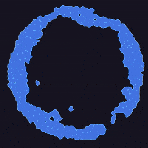

# Distantly Smooth Fluid



## How to build
Don't even try it, the setup is a mess right now :(.

Why?
This is just a JavaScript + ClayGL renderer interfacing with the actual fluid simulation compiled from Rust to Web Assembly, the setup isn't as straightforward as one would hope for.

As I have spent enough time in this project and I should actually be working on my thesis, so no proper easy setup for now, even if it hurts me to not do it.

After my thesis I will come back here, I promise!

```
TODO: Come back here
```

## TODO
- [ ] Add color to renderer
- [ ] Color palettes as a 2D texture
- [ ] Improve PixelJunk renderer
- [ ] Add [Kawase Blur](https://software.intel.com/en-us/blogs/2014/07/15/an-investigation-of-fast-real-time-gpu-based-image-blur-algorithms) + step renderer
